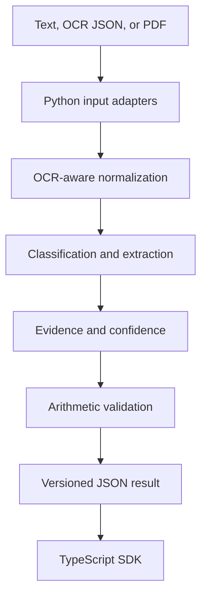

# Document Intelligence Pipeline

[](https://github.com/cmiedema25-rgb/document-intelligence-pipeline/actions/workflows/ci.yml)
[](https://www.python.org/)
[](sdk/tsconfig.json)
[](LICENSE)

An evidence-first pipeline that turns invoices and OCR output into validated,
structured JSON. Every extracted value includes a confidence score and a link
back to the source block, making the result reviewable instead of opaque.

The repository is intentionally focused on **three skills**:

| Skill | Proof in this repository |
| --- | --- |
| **Document AI & Extraction** | OCR block ingestion, document classification, normalized fields, line items, confidence, source evidence, arithmetic validation, and a golden-data benchmark |
| **Python** | Typed package, CLI, local JSON API, adapters, extraction pipeline, metrics, unit/integration tests, Ruff, and Python 3.11/3.12 CI |
| **TypeScript** | Strict typed SDK, runtime response validation, fetch client, declaration output, tests, and Node CI |

See [Skill Evidence](docs/SKILL_EVIDENCE.md) for direct links from each claim to
the implementation and tests.

## What it does

- Accepts `.txt`, `.md`, provider-neutral OCR `.json`, and optional text-based PDF input.
- Normalizes Unicode, spacing, dash variants, zero-width characters, and OCR line breaks.
- Classifies invoices and purchase orders.
- Extracts vendor, document number, dates, currency, subtotal, tax, total, and line items.
- Normalizes dates to ISO 8601 and currency amounts to fixed two-decimal strings.
- Attaches page, block id, original text, and optional bounding box to every extracted value.
- Validates line-item arithmetic and reconciles calculated totals with reported totals.
- Exposes the pipeline through a CLI and a small local HTTP API.
- Ships a strict TypeScript client that rejects malformed API responses at runtime.

## Architecture



The core has no runtime dependencies. PDF support is optional because scanned
PDFs should first be processed by an OCR provider; the neutral JSON adapter then
preserves the provider's pages and bounding boxes.

## Quick start

```bash
git clone https://github.com/cmiedema25-rgb/document-intelligence-pipeline.git
cd document-intelligence-pipeline
python -m venv .venv
source .venv/bin/activate  # Windows: .venv\Scripts\activate
python -m pip install -e ".[dev]"
pytest -q
```

Extract the included synthetic OCR invoice:

```bash
docintel extract samples/northstar-invoice.ocr.json
```

The output contains normalized values plus their evidence:

```json
{
  "document_type": "invoice",
  "fields": {
    "invoice_number": {
      "value": "INV-2026-1042",
      "confidence": 0.99,
      "evidence": [
        {
          "block_id": "b03",
          "page": 1,
          "text": "Invoice Number: INV-2026-1042",
          "bbox": {"x": 0.6, "y": 0.05, "width": 0.31, "height": 0.02}
        }
      ]
    }
  },
  "validation": {
    "balanced": true,
    "calculated_total": "376.71",
    "reported_total": "376.71",
    "difference": "0.00"
  }
}
```

## Input format

Plain text is accepted directly. OCR integrations can emit a neutral block
format so the extractor is not coupled to one cloud vendor:

```json
{
  "blocks": [
    {
      "id": "page1-line3",
      "page": 1,
      "text": "Invoice Number: INV-2026-1042",
      "bbox": [0.60, 0.05, 0.31, 0.02]
    }
  ]
}
```

Coordinates may be normalized values or pixels as long as the source uses one
consistent coordinate system.

## Local API

Start the dependency-free API:

```bash
docintel serve --port 8080
```

Health check: `GET /health`

Extraction: `POST /v1/extract`

```bash
curl http://127.0.0.1:8080/v1/extract \
  -H 'content-type: application/json' \
  -d '{"text":"DEMO SUPPLY\nInvoice Number: INV-9\nInvoice Date: 2026-08-30\nTotal: $7.00"}'
```

The demo server is intentionally local-first. Production deployments should
add authentication, TLS, rate limiting, tenant isolation, and controlled audit
logging at the gateway.

## TypeScript SDK

```bash
cd sdk
npm ci
npm test
```

```typescript
import { DocumentIntelligenceClient } from "@cmiedema/document-intelligence-sdk";

const client = new DocumentIntelligenceClient("http://127.0.0.1:8080");
const result = await client.extractText(invoiceText);

console.log(result.fields.invoice_number?.value);
console.log(result.validation.balanced);
```

The SDK uses TypeScript strict mode and also validates responses at runtime.
Static typing alone cannot protect a client when a remote API returns malformed
JSON, so `parseExtractionResult` checks nested evidence, confidence ranges,
line items, processing metadata, and provenance hashes.

## Benchmark

```bash
docintel benchmark samples/benchmark.json
```

The benchmark compares normalized business-field values and line-item counts
against checked-in golden data. This makes extraction changes measurable and
causes CI to fail when accuracy drops below the configured threshold.

## Tests and CI

```bash
ruff check .
pytest --cov=document_intelligence --cov-report=term-missing -q
cd sdk && npm test
```

GitHub Actions verifies:

- Python 3.11 and 3.12
- linting and typed package installation
- unit and HTTP integration tests
- real extraction against the OCR fixture
- golden-data benchmark accuracy
- TypeScript strict compilation, declaration generation, and Node tests

## Repository layout

```text
src/document_intelligence/
  adapters.py        Text, OCR JSON, and optional PDF adapters
  normalization.py   OCR-oriented Unicode and whitespace cleanup
  extractor.py       Classification, field extraction, and line items
  pipeline.py        Provenance, validation, warnings, and schema output
  metrics.py         Precision, recall, F1, and benchmark helpers
  server.py          Local JSON API
  cli.py             Extract, benchmark, and serve commands

sdk/
  src/types.ts       Public API model
  src/validation.ts  Runtime schema validation
  src/client.ts      Typed HTTP client
  test/              Node test suite

samples/             Synthetic text, OCR blocks, and golden output
tests/               Python unit and integration tests
docs/                Architecture, method, and skill evidence
```

## Honest scope

This is a portfolio-scale reference implementation, not a claim of universal
invoice accuracy. Extraction is deterministic and auditable; it does not call a
hosted model or send documents elsewhere. The included format is intentionally
clear so the evaluation is reproducible. Real deployments would add OCR/model
adapters, a labeled dataset covering many layouts and languages, table models,
human review queues, authentication, and monitoring.

All sample organizations and data are fictional. See [Security](SECURITY.md),
[Extraction Method](docs/EXTRACTION_METHOD.md), and [Architecture](docs/ARCHITECTURE.md).

## License

MIT License. See [LICENSE](LICENSE).
