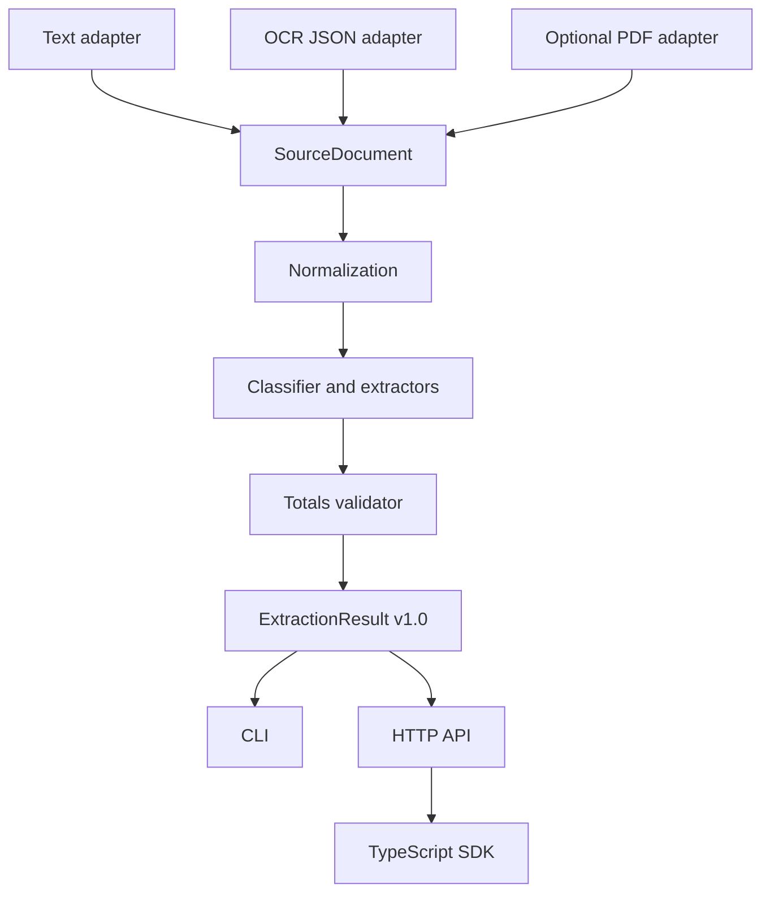

# Architecture

## Goals

The pipeline is designed around four properties: provider-neutral input,
traceable extraction, deterministic validation, and a stable consumer contract.

## Provider-neutral document model

Each source becomes an ordered tuple of text blocks. A block has a stable id,
one-based page number, text, and optional bounding box. Cloud OCR vendors can be
adapted at this boundary without leaking their schemas into extraction logic.

Plain text receives stable line ids. OCR blocks are sorted by page, vertical
position, horizontal position, and id. This supports predictable reading order
while preserving the original evidence reference.

## Extraction result

The versioned JSON contract contains:

- a content-derived `sha256:` document id;
- document type;
- normalized fields with confidence and evidence arrays;
- normalized line items with arithmetic confidence;
- totals validation;
- processing metadata;
- explicit warnings.

Money values use fixed two-decimal strings to avoid binary floating-point drift
between Python and JavaScript. Quantities remain numbers. The TypeScript SDK
represents the same decisions and validates remote JSON before returning it.

## Failure behavior

Malformed input raises a validation error before extraction. Missing fields,
unknown document types, absent line items, and arithmetic mismatches produce
warnings in otherwise usable results. This separates invalid requests from
valid but low-quality documents.

The HTTP boundary caps request bodies at 2 MiB and accepts JSON only. The core
does not make network calls and does not log document contents.
